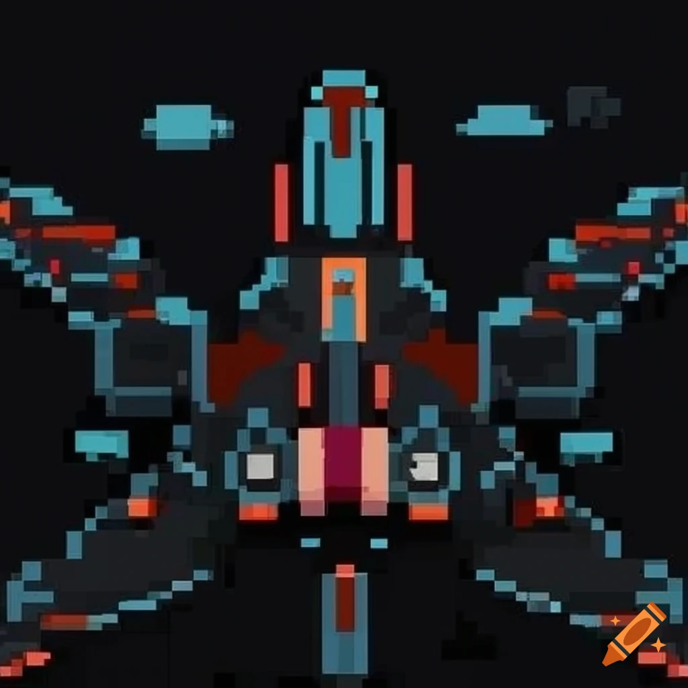

this is a simple Alien invasion game i made as a tutorial from the book [Python Crash Course](https://nostarch.com/python-crash-course-3rd-edition)

the ship and aliens are a free image i found on the internet and resized it,

   

you can add any other ships or aliens as long as you use the same name , size and format (.bmp)

this is the basic version of the game as it has only the features provided by the book.
but i plane on adding more features to the game.

An example of what i want to add:
1. make a moving stars in the background, as the ship is moving forward.
2. add more aliens with different mesh
3. make structures as Star Sword
4. options for difficulty levels